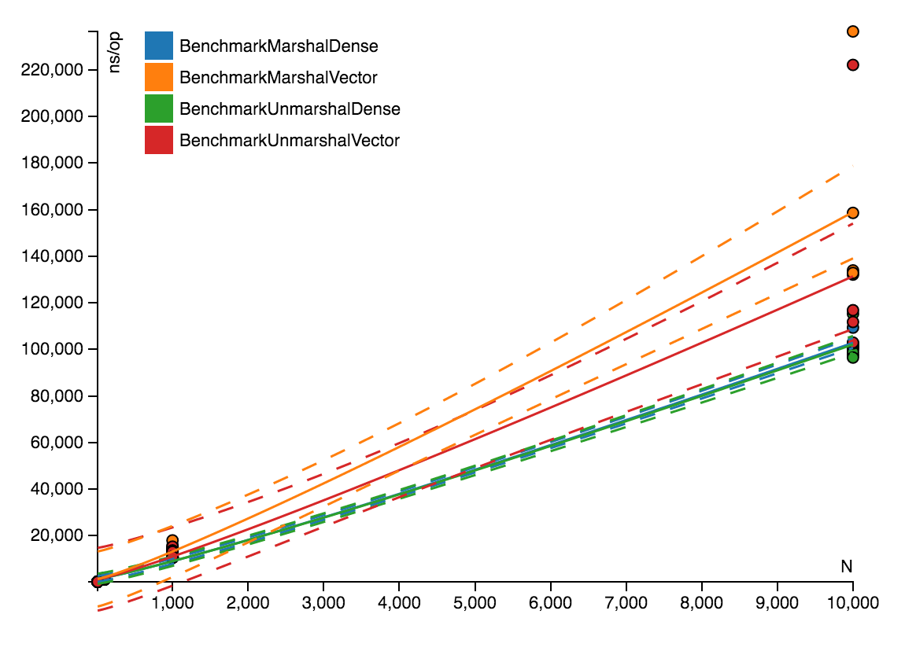

# benchplot

Go Benchmark Performance Plotting and Curve Fitting via Least Squares

`go get [-u] github.com/jonlawlor/benchplot`

Currently in a very preliminary state.  Use it like `./benchplot *.txt`

